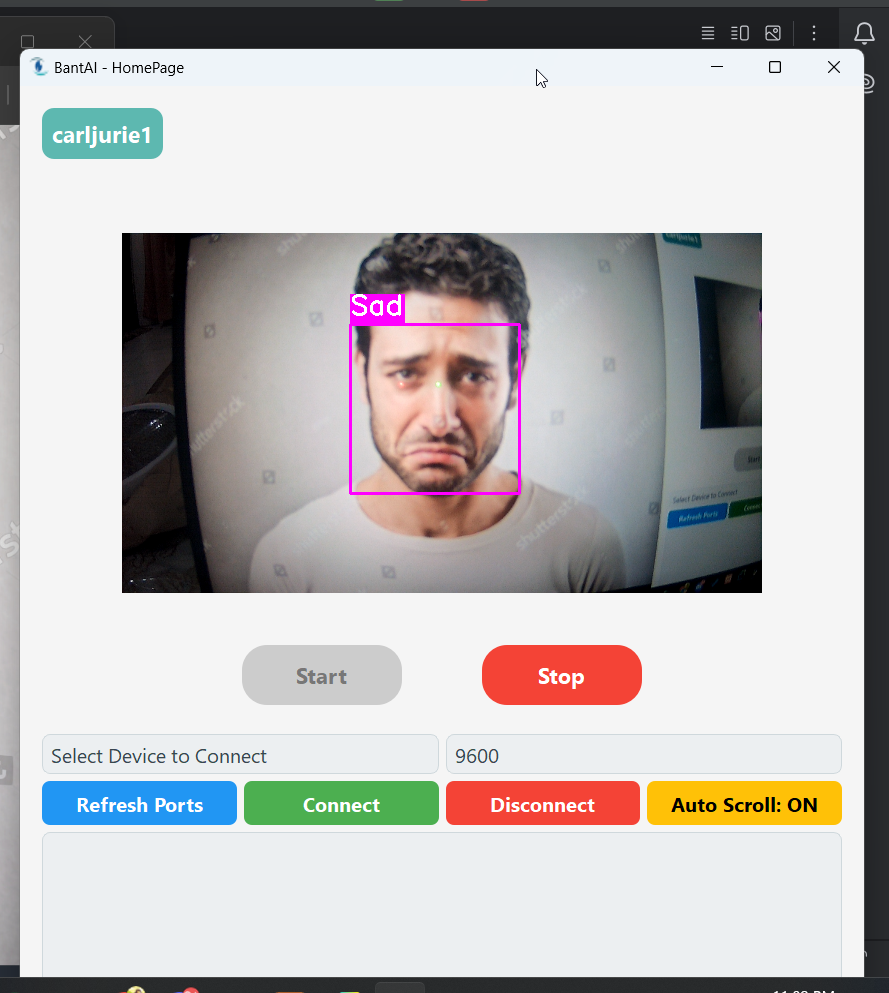
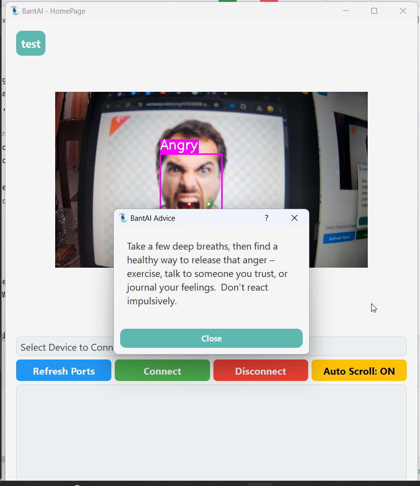
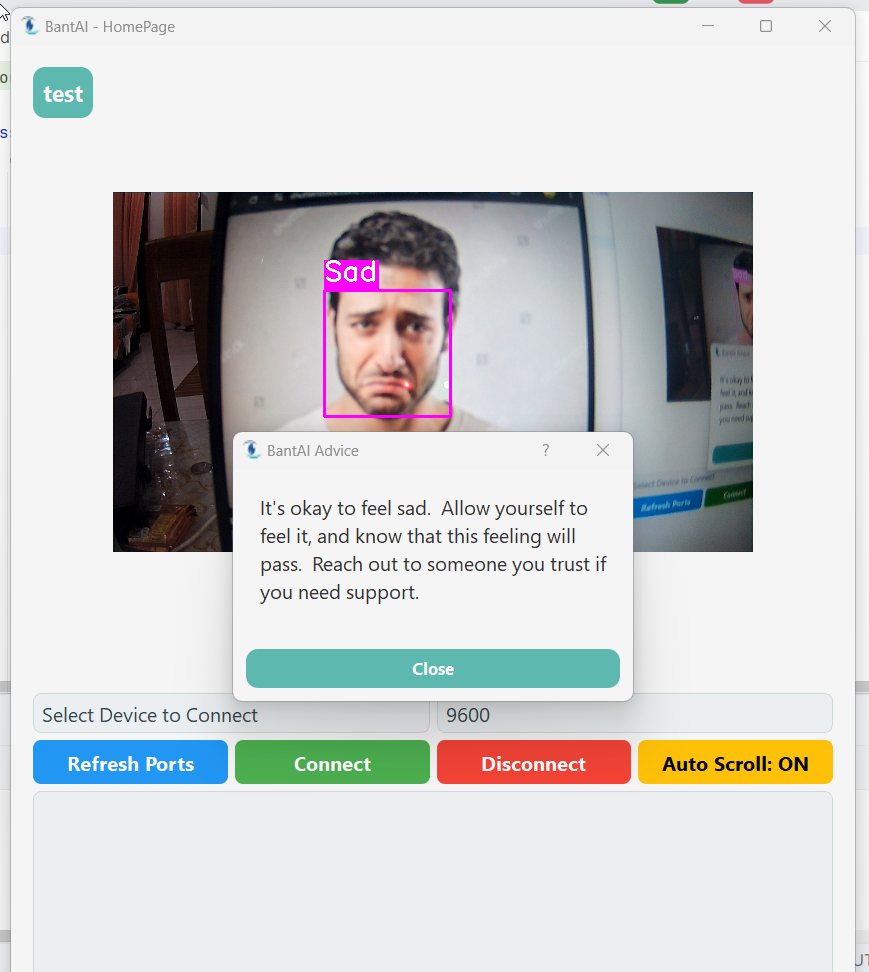

**To install neccessary libraries**

run:
python -r requirements.text

and also the sql, just import after activating xampp and click admin on MySQL

Run always the main.py

**--To Make this into desktop app--**

pip install pyinstaller (included in requirements)

run on terminal:
pyinstaller main.py --onefile

->Then wait to finish analyzing
->New folders will be created build and dist
->got to dist and create shortcut of it and put in desktop

